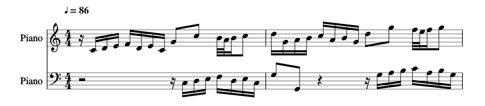
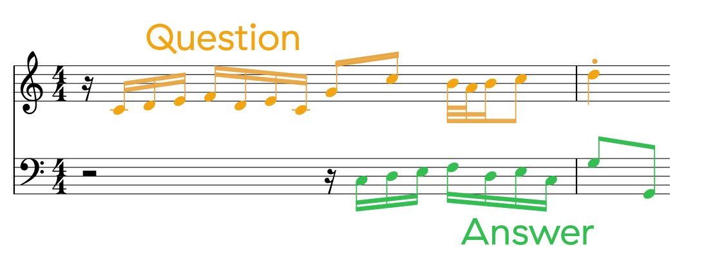
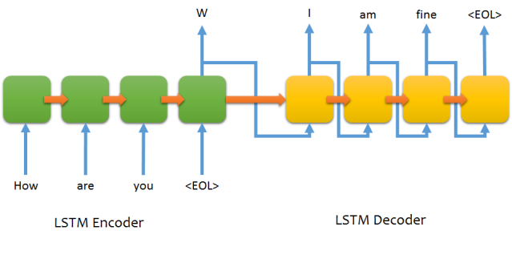

# Modelling Two-Part Polyphony @ hamr2018

Team: Eric Nichols, Anna Aljanaki, Stefano Kalonaris, Gianluca Micchi, Sebastian Stober

Contrapuntal music can be seen as a dialogue between two or more voices.
In the simple case of two-voice counterpoint (but also in countless other musical expressions, e.g. Afro-American music, West-African music, etc.), one can sometimes assimilate the musical interaction of the parts to the so-called 'antiphony' (sometimes referred to as 'call and reponse'): one voice asks a question and a second voice answers.

Here is an excerpt of a couple of measures from the first invention:

And here is how one could interpret it as a question\&answer:

We would like to come up with a model that is able to understand such a relation from some training data and, when given a musical question as an input, to generate an appropriate answer.

## The idea
Motivated by a natural language processing approach, we arbitrarily consider one of the parts as the question and the other as the answer. Moreover, we also arbitrarily segment each of these into four-bar chunks. These are gross simplifications, however, while we are aware that this representations misses out much contextual and musical value, we we up against time (this model been developed during HAMR2018). Furthermore, we consider question and answer as asynchronous whereas, in fact, in the music pieces (the two-part inventions) these are instead synchronous and difficult to unbind.
Nevertheless, we feel that this approximation is not entirely inappropriate since a composer has perfect information with respect to the composed material (since he/she is carefully writing it!)

This kind of problem is best solved with recurrent neural networks (RNN) and particularly a sequence to sequence approach.
See for example the following picture, taken from `https://github.com/farizrahman4u/seq2seq`:

For the seq2seq we parse Bach's two-part inventions MIDI files for each part and convert them into tokens (each token being a pair MIDI value/duration).

The model can be expanded through the use of Neural Turing Machine, which is a form of a memory network (network, that has access to RAM). Neural Turing Machines function much the same way as ordinary
Turing Machines, where a controller decides what to read from the memory and where to move its head. The difference is that a controller is a differentiable function (a neural network). We use an LSTM
with the same architecture as the sequence-to-sequence memoryless model as a controller for our NTM. 

## The training data
We take Bach's two-part inventions as a database because they are a homogeneous body of work which offers some variance while keeping well-defined internal laws.
Furthermore, the two-part inventions are very well-known and regarded as a textbook example of contrapuntal music.
They are relatively simple and could provide an excellent training set for a small model;

In order to represent tonal qualities and hierarchical music structures we firstly transposed all the songs to the key of C major or A minor, accordingly.

## The results
TODO

## Future Work
Since the chunking was made arbitrarily every four measures, it's likely that the learnt representations and the generated responses are of limited musical value. It would be advisable to use a domain-expert to manually segment the two-part variations into more semantically valid chunks.
We started doing this for the first two inventions (found in Bach-Two_Part_Inventions_MIDI_Phrases). These could be used as a validation set or they could be completed to include the whole corpus in order to train the model accordingly.
